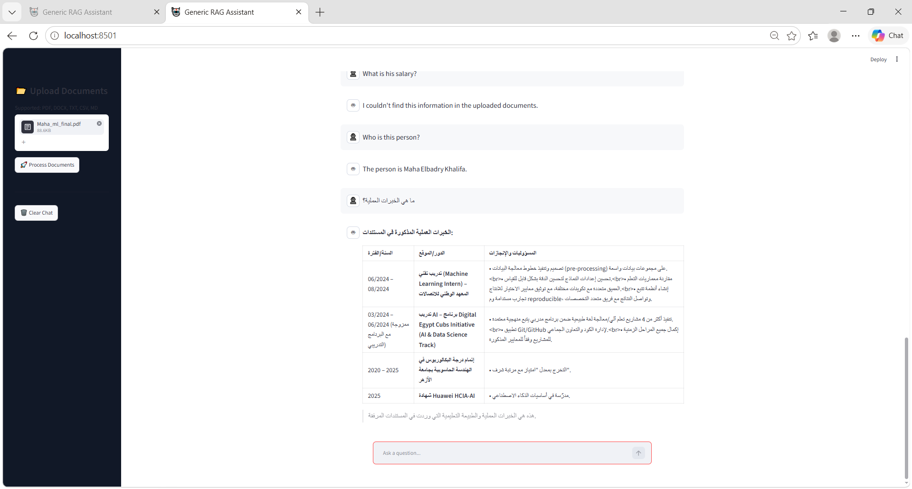
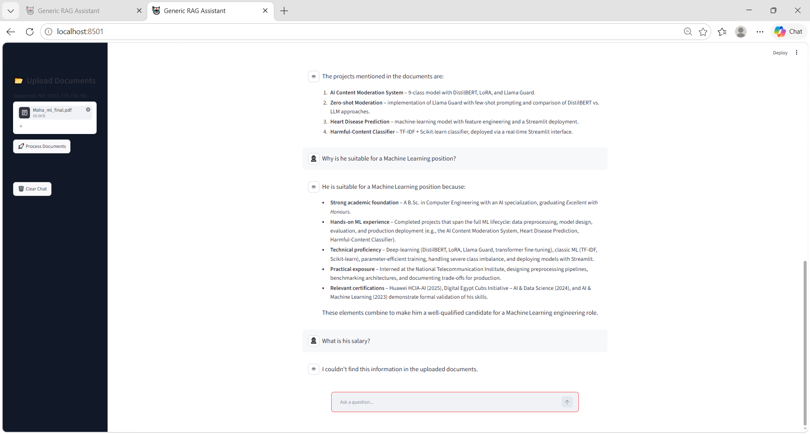
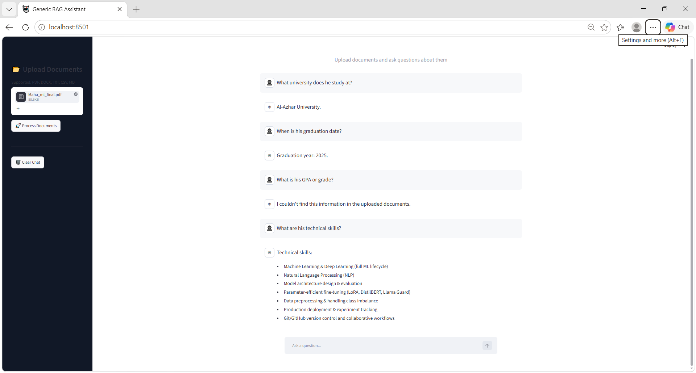
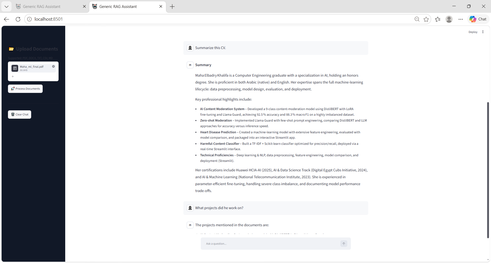

# 🤖 Multilingual Generic RAG Assistant

A powerful Retrieval-Augmented Generation (RAG) chatbot that enables users to upload documents, build a vector database, and interact with their data through natural language conversations in both **Arabic** and **English**.

---

## 📸 User Interface

### 🏠 Main Interface



### 🌍 Arabic Language Support



### 📂 Document Upload & Processing



### 💬 Chat Experience



---

## 📌 Overview

This project implements a complete **Retrieval-Augmented Generation (RAG)** pipeline using modern AI technologies.

The assistant allows users to:

* Upload one or multiple documents.
* Process and index documents using embeddings.
* Store document representations inside a FAISS vector database.
* Retrieve relevant information from uploaded documents.
* Generate accurate responses grounded in document content.
* Interact naturally in Arabic and English.

---

## ✨ Features

### 📂 Multi-Document Support

Supports uploading multiple document formats:

* PDF (.pdf)
* Word (.docx)
* Text (.txt)
* CSV (.csv)
* Markdown (.md)

---

### 🔍 Retrieval-Augmented Generation (RAG)

The system follows the complete RAG workflow:

1. Load documents.
2. Split documents into chunks.
3. Generate embeddings.
4. Store vectors in FAISS.
5. Retrieve relevant chunks.
6. Generate contextual answers using an LLM.

---

### 🌍 Multilingual Responses

The chatbot automatically adapts to the user's language.

**Examples:**

* Arabic Question → Arabic Answer
* English Question → English Answer

---

### 🧠 Conversational Memory

The assistant maintains short-term chat history to support contextual follow-up questions.

When a new set of documents is uploaded:

* Previous chat history is cleared.
* Previous vector database is removed.
* New vector database is generated.

This prevents mixing information between different uploaded documents.

---

### 💾 FAISS Vector Database

Document embeddings are stored in a FAISS vector database for efficient semantic search and retrieval.

---

### 🛡️ Hallucination Reduction

The assistant is instructed to answer only from the uploaded documents.

If information is unavailable, it responds with:

**English**

> I couldn't find this information in the uploaded documents.

**Arabic**

> لم أتمكن من العثور على هذه المعلومة في الملفات المرفوعة.

---

## 🏗️ System Architecture

```text
User Uploads Documents
          │
          ▼
   Document Loader
          │
          ▼
    Text Chunking
          │
          ▼
      Embeddings
          │
          ▼
   FAISS Vector DB
          │
          ▼
   Similarity Search
          │
          ▼
    OpenRouter LLM
          │
          ▼
      Final Answer
```

---

## 🛠️ Technologies Used

| Technology             | Purpose               |
| ---------------------- | --------------------- |
| Python                 | Core Development      |
| Streamlit              | User Interface        |
| LangChain              | RAG Pipeline          |
| FAISS                  | Vector Database       |
| HuggingFace Embeddings | Embedding Generation  |
| Sentence Transformers  | Semantic Embeddings   |
| OpenRouter             | LLM Inference         |
| dotenv                 | Environment Variables |

---

## 📁 Project Structure

```text
Multilingual-Generic-RAG-Assistant/
│
├── assets/
│   ├── UI3.png
│   ├── UI4.png
│   ├── UI5.png
│   └── UI6.png
│
├── app.py
├── rag.py
├── requirements.txt
├── README.md
├── .gitignore
└── .env
```

---

## ⚙️ Installation

### 1️⃣ Clone Repository

```bash
git clone https://github.com/mahaelbad/Multilingual-Generic-RAG-Assistant.git

cd Multilingual-Generic-RAG-Assistant
```

### 2️⃣ Create Virtual Environment

```bash
python -m venv venv
```

### 3️⃣ Activate Virtual Environment

Windows:

```bash
venv\Scripts\activate
```

Linux / Mac:

```bash
source venv/bin/activate
```

### 4️⃣ Install Dependencies

```bash
pip install -r requirements.txt
```

---

## 🔑 Environment Variables

Create a `.env` file in the project root directory:

```env
OPENROUTER_API_KEY=your_api_key_here
```

---

## ▶️ Run Application

```bash
streamlit run app.py
```

---

## 🧪 Example Questions

### English

```text
What are the candidate's skills?

Summarize the uploaded document.

What work experience is mentioned?

Does the candidate have Machine Learning experience?
```

### Arabic

```text
ما هي المهارات المذكورة؟

لخص الملف.

ما هي الخبرات العملية؟

هل لديه خبرة في تعلم الآلة؟
```

---

## 🚀 Future Improvements

* OCR support for scanned PDFs
* PowerPoint (.pptx) support
* Source citations in answers
* Streaming responses
* Docker deployment
* Cloud deployment
* Authentication and user accounts

---

## 👩‍💻 Author

**Walaa Elbadry**

Software Engineering Student
Machine Learning & Artificial Intelligence Enthusiast

---

## ⭐ Support

If you found this project useful, consider giving it a ⭐ on GitHub.

